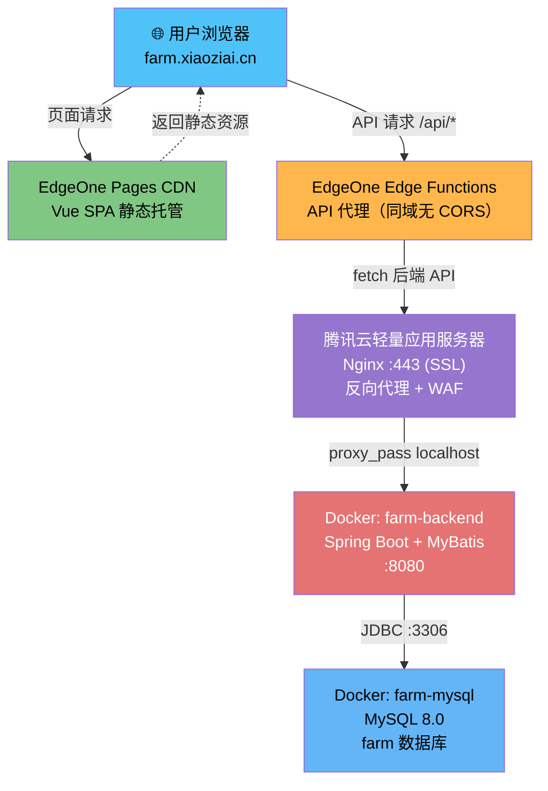

# Farm Optimize — 农场综合管理系统

> 🌐 在线访问：<https://farm.xiaoziai.cn/>

基于 Spring Boot + Vue 2 的前后端分离农场与餐厅综合管理系统，支持员工管理、考勤、销售、采购、预约点餐、报表导出等功能，涵盖 6 种角色权限。

***

## 技术栈

| 层        | 技术                | 版本           |
| -------- | ----------------- | ------------ |
| 后端框架     | Spring Boot       | 2.2.5        |
| ORM      | MyBatis           | 2.1.3        |
| 数据库      | MySQL             | 8.0          |
| 运行时      | Java (OpenJDK)    | 11           |
| 前端框架     | Vue.js            | 2.6          |
| UI 组件库   | Element UI        | 2.13         |
| CSS 框架   | Bootstrap         | 4.4          |
| Excel 导出 | Apache POI + jxls | 3.15 / 1.0.6 |

***

## 系统架构



***

## 快速开始

### 环境要求

| 依赖      | 最低版本 | 说明                   |
| ------- | ---- | -------------------- |
| Java    | 11   | OpenJDK / Oracle JDK |
| Maven   | 3.6  | 后端构建                 |
| Node.js | 12   | 前端构建                 |
| MySQL   | 8.0  | 数据库，字符集 utf8mb4      |

### 1. 初始化数据库

```bash
mysql -u root -p < 部署/schema.sql
```

该脚本会创建 `farm` 数据库及全部 17 张表（`IF NOT EXISTS`，可安全重复执行）。

### 2. 启动后端

```bash
cd backend
mvn spring-boot:run
```

后端默认运行在 `http://localhost:8080`。

### 3. 启动前端

```bash
cd frontend
npm install --registry=https://registry.npmmirror.com
npm run dev
```

前端默认运行在 `http://localhost:8081`，API 请求代理到本地后端 `http://localhost:8080/`。

***

## AI 驱动重构

本项目采用 AI 编码工作流全流程辅助重构：

- **后端重构**：Spec Kit 规格驱动，将 Hibernate→MyBatis 框架迁移拆解为 86 个任务，8 阶段全量完成
- **前端重构**：OpenSpec 变更驱动，管理 UI 美化迭代；ui-ux-pro-max 负责页面优化
- **质量保障**：gstack 自动化 QA（32 页面全量验证，健康评分 100/100）+ AI 代码审查 + 工程架构审查

